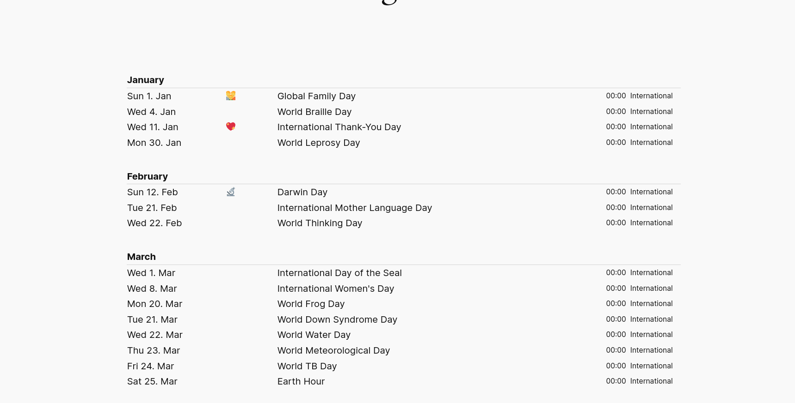
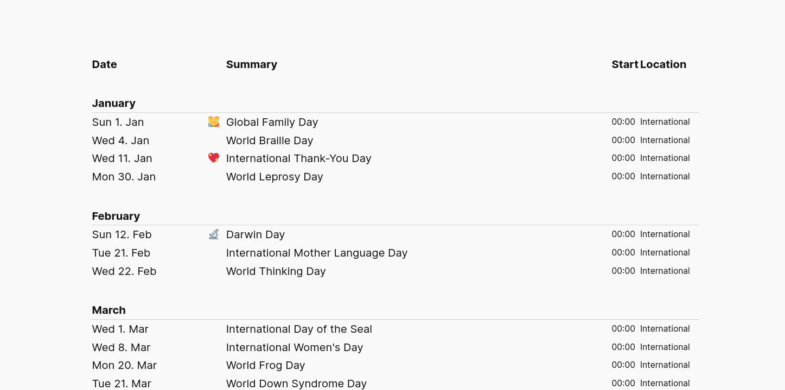
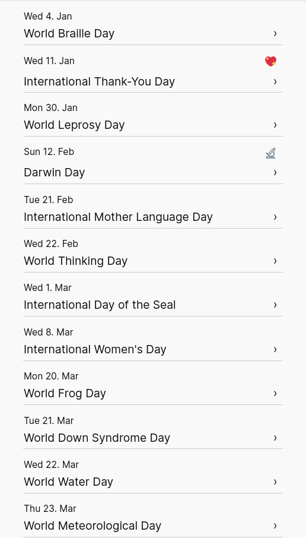
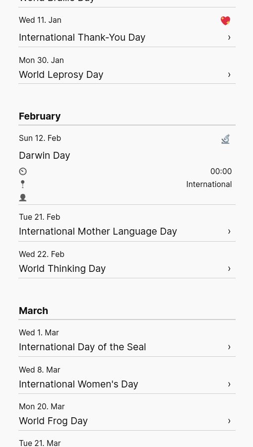
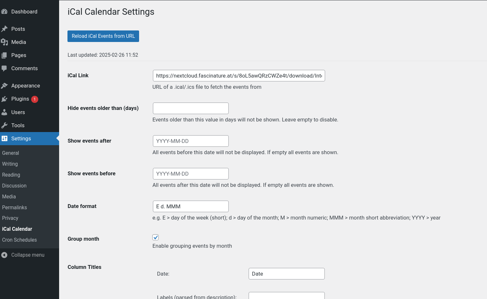
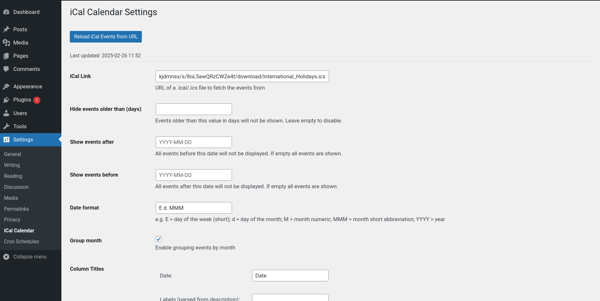
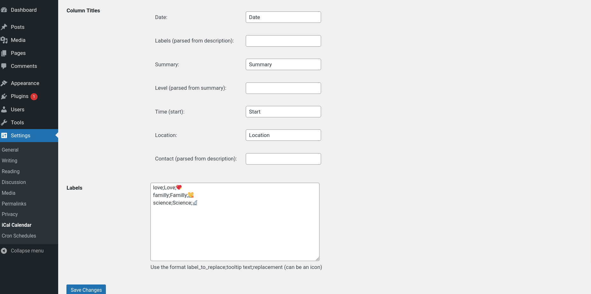
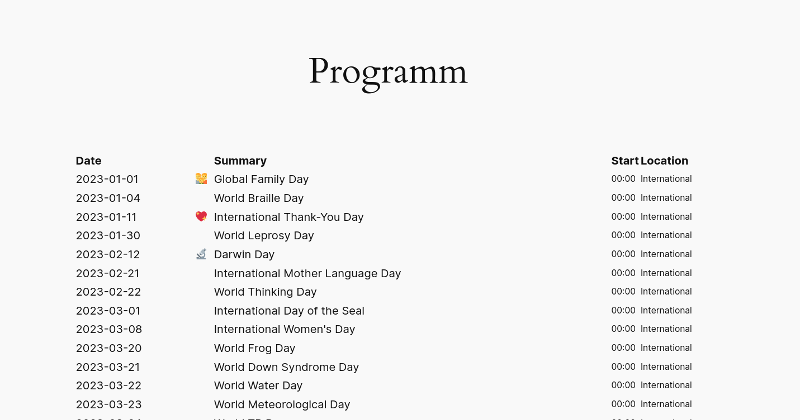
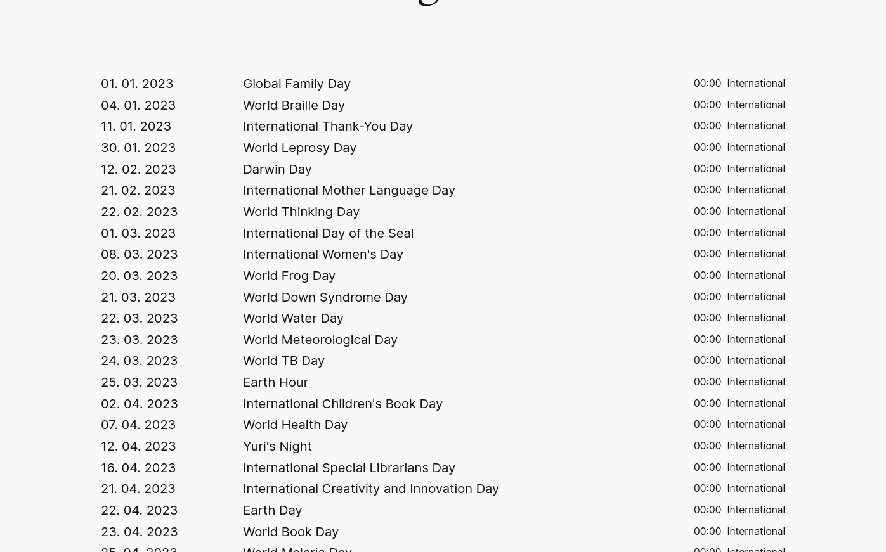

# iCal Calendar
Contributors: @me1es
Donate link: 
Tags: "events" "google calendar" "iCalendar" "office 365" "ical" "ics" "ical feed"
Requires at least: 4.7
Tested up to: 6.7.2
Stable tag: 1.0
Requires PHP: 7.0
License: GPLv2 or later
License URI: https://www.gnu.org/licenses/gpl-2.0.html
iCal Calendar is a WordPress Plugin that fetches events from an .ical/.ics URL and displays them as a table on your WordPress page.

## Usage

Use the shortcode `[ical_events]` to insert the calendar into your page or post.

In the current version, only one calendar is supported, which should be sufficient for most websites.

Calendars are automatically refreshed every hour using WordPress cron jobs.

## Parsing Special Information

Considering its intended purpose, iCal Calendar can parse certain information from the subject and description fields. This functionality is still partly hardcoded and will be made more flexible in the future, but it won't affect you if you don't need it. The information parsed includes:

| Column  | Section    | Keyword                                |
|---------|------------|----------------------------------------|
| Labels  | Description| `LABELS:` (Deprecated: `GROUP:`)     |
| Level   | Summary    | `Regex(/(WW [-IV\+ ]+)+/)`           |
| Contact | Description| `CONTACT:`                            |

Information parsed from Labels can be replaced by entering the desired information in the labels field. 

`kids;also for children;🐣` replaces the value `kids` with the 🐣 emoji and fills the `title` attribute with `also for children`, so you get more information when hovering over the emoji. Multiple replacements are supported.

## Limitations

- iCal Calendar does not yet support time zones.
- Repeating events have not yet been tested.
- After changing the settings, you might have to reload the data for the changes to take effect.

## Screenshots

